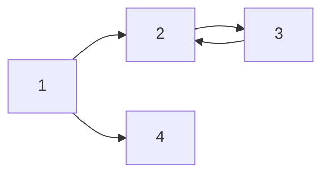

# H1 태그( 제목)
## 지현 
### 지현
#### 지현
##### 지현 (일반 크기와 같음)

_italic_

**bold**

**_italic+bold_**
~~hello~~

>안녕하세요 이건 Quote 입니다. ~

---

- list 1
- list 2
- list 3
    - A
    - B

1. List 1
2. List 2
3. List 3
    1. A
    2. B


| Title | Description | 비고|
| -|-|-|
|안녕|1|2|
|할로|3|4|

---


[지현님의 블로그](blog.naver.com/j4849)


---


`simple code`

``` python
#include <studio.h>
int mains(){
    printf("hello world");
    return 0;
}
```

----

$a^2 + b^2 = c^2$

---

