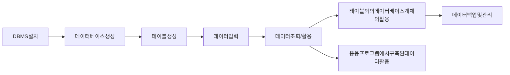

---
title : "MySQL 백과사전1(출처 : 이것이 MySQL이다.)"

### 어쩌면 개발 업계에서 상당부분 중요하다고 느껴지는 MySQL을 본격적으로 시작하게 되었다. 

SQL의 스토리라인은 이미 [우아한테크코스 JPA와 JDBC](https://www.youtube.com/watch?v=Ppqc3qN75EE)와 [우아한 테크코스 JDBC, SQLMAPPER,ORM](https://www.youtube.com/watch?v=mezbxKGu68Y&t=1057s) 등으로 알게 되었지만, 여전히 전반적인 용어에 대한 정리가 요구된다.

SQL에 대한 용어가 은근 어렵다. (정확하게 말하면 어색하다.)

대부분의 코딩들이 앞으로는 MySQL 기반으로 작성될 예정인데, 

내가 구상한 프로세스인 
무엇이든 
1.  용어를 공부하고, 
2. 메커니즘(구조)을 공부하고, 
3.  유투브, 블로그, 기술블로그로 공부해가며, 
4. 책과 예제로 공부를 하고
위의 메커니즘에 맞게 진행해보고 싶다. 

이러한 작업의 일환으로 MySQL(정확히는 SQL)에 대한 용어를 모두 알아가고 싶어 졌다.
(레퍼런스로 찾아본 사이트들도 일부만 알려주고 있어서 통합하고 싶은 마음이 아주 컸다...)

책은 학원 교재로 있는 [이것이 MySQL이다.& YouTube](https://youtu.be/xKYeJxBTt2E)를 기반으로 앞으로 공부할 예정이다. 

|용어|의미|
|-|-|
|DBMS|관계형 데이터베이스, 데이터베이스를 관리 및 운영하는 역할|
|데이터베이스|데이터의 집합, 데이터의 공간 자체, 여기서는 '데이터베이스'를 자료가 저장되는 디스크 공간으로 취급하.ㅁ|
|주요 DBMS|MySQL, MariaDB, Oracle -> 자세한 스토리른 다들 아니까 생략|

|데이터 베이스의 특징|설명|
|-|-|
|데이터의 무결성|데이터에 요류가 있으면 안되서 제약조건이 따름|
|데이터의 독립성|데이터베이스의 크기를 변경하거나 데이터 파일의 저장소를 변경하더라도 기존에 작성된 응용 프로그램은 전혀 영향을 받지 않는다.|
|보안|데이터를 소유한 사람이나 데이터에 접근이 허가된 사람만 접근할 수 있음. 사용자의 계정에 다라서 다른 권한을 갖음.|
|데이터 중복의 최소화|동일한 데이터가 여러개 중복되어 저자오디는 것을 방지함 |
|응용 프로그램 제작 및 수정의 용이성|데이터베이스를 이용함으로써 통일된 방식으로 응용 프로그램 작성이 가능해짐.|
|데이터의 안정성 향상|대부분의 DBMS가 제공하는 백업&복원 기능을 이용함으로서, 데이터가 깨지는 문제가 발생할 경우에 원상으로 복원 또는 복구하는 방법이 명확해진다. |

아래 발전 부분은 [플레이데이터](https://blog.naver.com/encore_playdata/221639334025)를 추가로 참고하였다.

|데이터베이스의 발전||
|-|-|
|오프라인으로 관리|장부로 작성|
|파일시스템의 사용|컴퓨터 파일에 기록 저장함. 데이터 양이 많아지면 데이터 중복으로 인한 불일치 발생함. 그럼에도 불구하고 데이터 처리속도가 빠르고, 별도의 추가비용이 들지 않아 아직 많이 사용됨. |
|데이터베이스 관리시스템|데이터의 집합인 '데이터베이스'를 잘 관리하고 운영하기 위한 시스템 또는 소프트웨어, 이를 위한 언어가 SQL(Structured Query Language)-> 관리 및 추출이 가능해짐.|

|DBMS의 분류|설명|
|-|-|
|계층형 DBMS|트리 형태로 1:N 관계를 갖음. 처음 구축 이후에는 구조를 변경하기 까다로움. 검색도 어려움|
|망형 DBMS|1:1, 1:N, N:M 등의 관계가 지원되어 효과적이고 빠른 데이터 추출이 가능함. 매우 복잡한 내부 포인터를 사용하고 프로그래머가 모드 구조를 이해해야만 프로그램의 작성이 가능하다는 단점이 존재함. |
|관계형 DBMS|데이터 베이스는 테이블이라 불리는 최소 단위로 구성됨.(표), 테이블을 부르는 다른 용어로는 릴레이션, 엔티티 등이 있다. 장점 : 쉽게 변화에 순응할 수 있으며 유지보수 쉬움, 단점 : 시스템 자원을 많이 차지해서 시스템이 전반적으로 느려짐. |

DBMS의 주요기능은 아래와 같음
1. 데이터의 추가/조회/변경/삭제
2. 데이터의 무결성 유지
3. 트랜잭션 관리
4. 데이터의 백업 및 복원
5. 데이터의 보안

|SQL 표준|내용|
|-|-|
|DBMS 제작회사와 독립적|각 제작회사는 표준 SQL에 맞춰서 개발함. 그래서 공통적으로 호환된다.|
|높은 이식성|DBMS마다 상호 호환성이 뛰어나서, 다른 시스템으로 이식하는데 문제가 없다.|
|표준이 계솔 발전함|지금도 개선안이 연구 보안됨|
|대확식 언어|바로 질의하고 결과를 얻는 대화식 언어|
|분산형 클라이언트/서버 구조|SQL은 분산형 구조인 클라이언트/서버 구조를 지원함. 클라이언트에서 질의하면 서버에서 그 질의를 받아서 처리한 후, 다시 클라이언트에게 전달하는 구조.|
|구분|Oracle에서는 PL/SQL이라 부르고, SQL Server에서는 T-SQL, MySQL에서는 SQL이라고 부름.|

### SQL의 역사를 살펴보자면, 
오라클(그 전에는 선마이크로, 사실은 마이클 위데이니우스, 데이빗 액스마크)에서 만들어서 각종 트리, 쿼리, 커서, 프로시져, 트리거, 뷰등이 지원되고, 파티셔닝, 복제가 가능해지고, InnoDB를 기본 엔진으로 사용하고 확장하고, NoSQL을 지원하고 확장하고, JSON을 지원하고 확장하는 등의 발전을 거듭했다고 한다. 

### MySQL의 에디션
결국에 Standard를 쓰거나 MariaDB를 쓸 것이기에..패스...ㅎㅎ

### (알아두면 좋은) 설치시 폴더의 역할

|폴더|역할|
|-|-|
|bin|MySQL 서버 프로그램, 클라이언트 프로그램 치 유틸리티 프로그램 파일|
|docs|도움말 또는 설정 파일|
|etc|설정 파일 샘플|
|include|응용 프로그램을 개발할 때 필요한 헤더 파일|
|lib|MySQL 관련 라이브러리 파일|
|share|기타 지원파일, 각 언어별 오류 메시지 파일|

#### 정보시스템을 구축하기 위해서는 일반적으로 분석, 설계, 구현, 시험, 유지보수의 5단계를 거침
|단계|설명|
|-|-|
|분석단계|시스템 분석 또는 요구사항 분석, 우리가 무엇을 할 것인지를 결정함. 사용자의 인터뷰와 업무 조사 등을 수행해야 함. 분석의 결과로서 많은 무서를 작성함|
|설계|시스템 설계 또는 프로그램 설계, 시스템을 어떻게할 것인지를 결정함|
|구현|프로그래머에게 넘겨 주면 프로그래머는 설계서에 나온 그대로 프로그램을 작성함|
|시험 유지보수|위의 과정과 유사함|

### 드디어 시작하는 데이터베이스 모델링과 필수 용어

|용어|설명|
|-|-|
|데이터|하나하나의 단편적인 정보, 즉 정보는 있으나 아직 체계화되지 못한 상태|
|테이블|데이터를 입력하기 위해, 표 형태로 표현한 것.|
|데이터베이스(DB)|테이블이 저장되는 저장소.|
|DBMS|DataBase Management Systme의 약자로 데이터베이스를 관리하는 시스템 또는 소프트웨어|
|열|각 테이블은 열로 구성되며 컬럼 필드라고도 불린다. |
|데이터 형식|열의 데이터 형식을 말한다. 데이터 형식은 테이블을 생성할 때 열 이름과 함께 지정해줘야 함.|
|행|실질적인 데이터를 말함. 행 데이터라고도 불리며, 로우 레코드라고 불린다. |
|키|한 Relation에서 각각의 tuple(행)을 유일하게 식별하기 위해 사용하는 하나 혹은 그 이상의 속성들의 집합|
|기본 키|기본 키 열은 각 행을 구분하는 유일한 열을 말한다. 중복도 공백도 허용하지 않느다. 각 테이블에는 기본키가 하나만 지정되어 있어야 한다. 이런 경우는 일반적으로 중복을 피하기 위해서 아이디를 가지고 활용한다. |
|외래 키|두 테이블의 관계를 맺어주는 키|
|SQL|Structured Queery Language(구조화된 질의 언어), SQL은 사람과 DBMS가 소통하기 위한 언어이다. |

아래 두 부분은  [개발자 장](https://wkdtjsgur100.github.io/database-terms/)님의 자료를 참고하였다.

### 데이터 베이스의 특징
|특징|설명|
|-|-|
|유일성|하나의 키로 어떠한 행을 바로 찾아낼수 있는 성질|
|최소성|레코드를 식별하는데 꼭 필요한 속성들로만 구성되어 있는 성질|

### key 종류
|키|한 Relation에서 각각의 tuple(행)을 유일하게 식별하기 위해 사용하는 하나 혹은 그 이상의 속성들의 집합|
|-|-|
|기본 키|기본 키 열은 각 행을 구분하는 유일한 열을 말한다. 중복도 공백도 허용하지 않느다. 각 테이블에는 기본키가 하나만 지정되어 있어야 한다. 이런 경우는 일반적으로 중복을 피하기 위해서 아이디를 가지고 활용한다. |
|외래 키|두 테이블의 관계를 맺어주는 키|
|슈퍼키|유일성을 만족하는 키|
|복합 키|2개 이상의 속성을 사용한 키|
|후보 키|유일성과 최소성을 만족하는 키. 기본키가 될수 있는 후보여서 후보키|
|대체 키|후보 키 중에 기본키로 선택되지 않은 키|
|외래 키|어떤 테이블 간의 기본키를 참조하는 속성, 테이블 간의 관계를 나타내기 위해서 사용함|

### MySQL을 이요한 데이터베이스 구축 절차

|Workbench 관련용어|설명|
|-|-|
|쿼리 창|쿼리를 직접 입력한느 곳으로 가장 많이 사용되는 창|
|쿼리 실행 버튼|쿼리 창에 입력된 쿼리문을 실행함. |
|쿼리 결과|쿼리창에 SQL을 입력하고 결과 목록이 출력됨|
|결과 메시지 창|쿼리가 정상 실행되거나, 오류가 발생한 경우 결과 메시지가 나온다.|
|데이터 개수|쿼리의 수행 결과로 몇 건의 데이터가 조회되었는지 개수를 보여준다.|
|쿼리 수행 시간|SQL을 수행해서 결과가 나오기까지 소요된 시간|
|서버 관리 창|서버의 상태, 데이터 가져오기/내보내기 등의 MySQL을 관리하기 위한 기능을 제공함.|
|데이터베이스 목록창|MySQL 내부에 존재하는 데이터베이스의 목록과 그 내부 테이블 등을 보여줌. 데이터베이스를 더블 클릭하면 해당 데이터베이스가 선택됨|
|||

